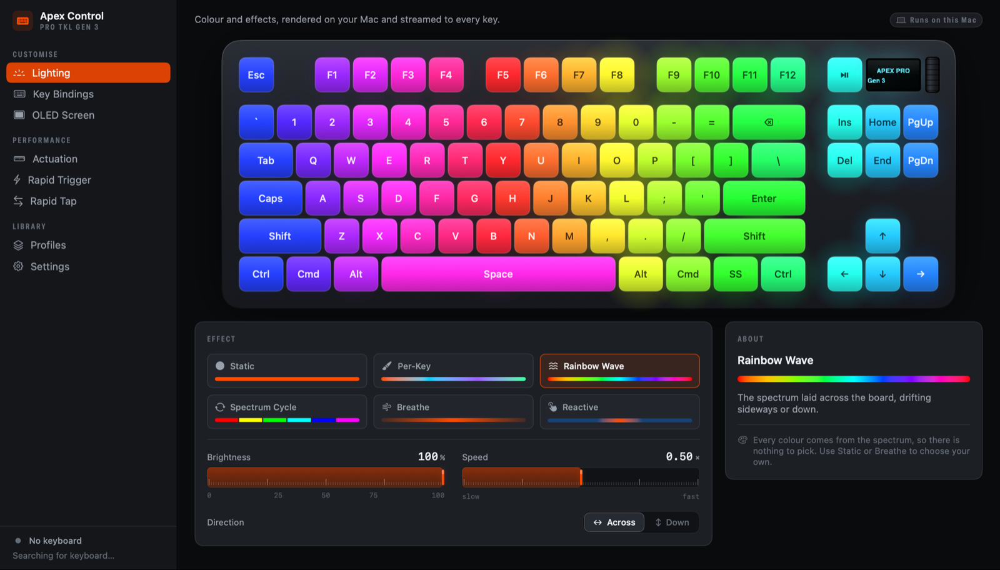
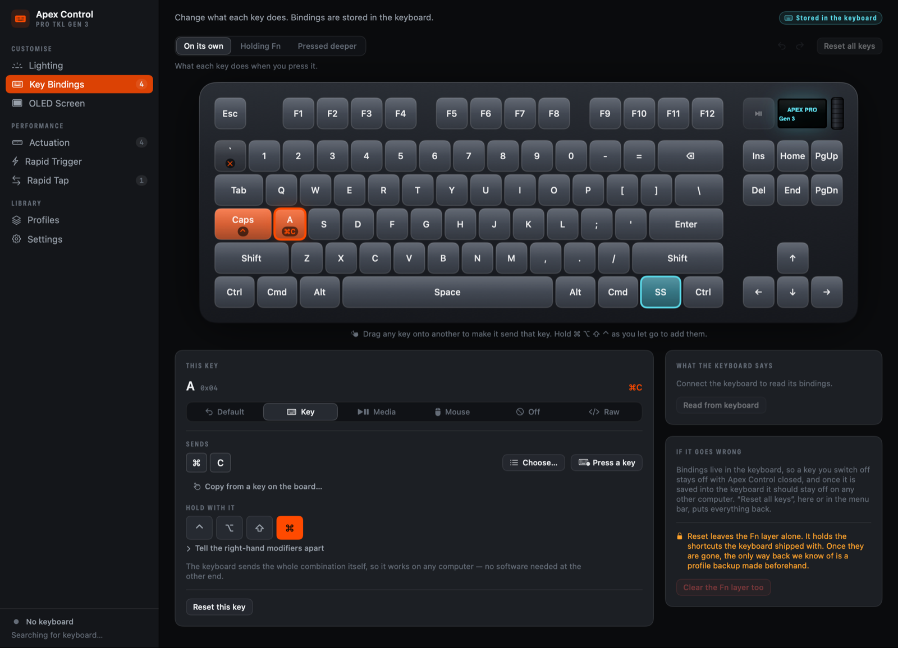

# Using the app

A tour of Apex Control: what each pane does, what its controls mean, and where
your settings end up. For the command-line tool, see
[Using the CLI](USING-THE-CLI.md); if something is not working, see
[Troubleshooting](TROUBLESHOOTING.md).

*The Lighting pane. Screenshots here are rendered by the app's own snapshot
harness with no keyboard attached, so the sidebar says "No keyboard".*

## Getting started

1. Install the app ([README](../README.md#install)) and open it.
2. Plug the keyboard in with its USB cable. Apex Control picks it up on its own;
   there is nothing to press. The bottom of the sidebar says **Connected** and
   shows the firmware, region and layout.
3. Change things. There is no Apply button: lighting, actuation, rapid trigger,
   rapid tap, bindings and the screen are sent to the keyboard as you change them.
   (Profiles are the exception; see [Profiles](#profiles).)

The app is dark on purpose. Every pane previews light the keyboard is about to
emit, and a light surround would misrepresent it.

## The window

The sidebar has three groups:

- **Customise**: Lighting, Key Bindings, OLED Screen
- **Performance**: Actuation, Rapid Trigger, Rapid Tap
- **Library**: Profiles, Settings

⌘1 to ⌘8 jump to them in that order. Each pane opens with one line saying what it
is for.

**Where a setting lives.** The tag at the top right of every pane except Settings
says whether its settings are held by your Mac or by the keyboard, which is the most
important fact about this hardware:

- **Runs on this Mac**: Apex Control renders it, so it needs the app running.
  Lighting, the screen and profiles are like this. (A screen can also be saved into
  the keyboard; see [OLED Screen](#oled-screen).)
- **Stored in the keyboard**: written into the keyboard, so it keeps working with
  the app closed, and should on any other computer. Key Bindings, Actuation, Rapid Trigger
  and Rapid Tap are like this, and only these four panes show a save state. While the
  keyboard is connected, the tag reads *Saving to the keyboard…*, *Saved in the
  keyboard*, *Not saved to the keyboard*, or *Can't save to this keyboard*.

**Badges.** A small number beside Key Bindings, Actuation or Rapid Tap counts what
you have changed: keys with a binding, keys with their own actuation point, or
active rapid-tap pairs. On a stock keyboard the Key Bindings number may not start at
zero: the keyboard ships with nine Fn shortcuts of its own.

A red banner reports an error and stays until you dismiss it. A cyan note confirms
an action and clears itself after a few seconds.

## Lighting

Effects are drawn by your Mac and streamed to the keyboard 30 times a second, so
you are not limited to the firmware's built-in modes, and the app has to be running
for them to move. The picture of the keyboard is a live copy of what the keyboard
is showing.

The defaults on a first launch are Rainbow Wave, 100 % brightness, speed 0.50,
direction Across.

| Effect | What it does | Controls |
|---|---|---|
| **Static** | One colour, held steady. | Brightness, Colour |
| **Per-Key** | Paint each key its own colour. Keys with no colour are off, so your first selection darkens the board. | Brightness, the paint tools |
| **Rainbow Wave** | The spectrum laid across the board, drifting sideways or down. | Brightness, Speed, Direction (Across or Down) |
| **Spectrum Cycle** | The whole board one colour at a time, working through the spectrum. | Brightness, Speed |
| **Breathe** | One colour rising and falling. | Brightness, Speed, Colour |
| **Reactive** | Keys light as you press them, send a ripple across the board, and fade back to a resting colour. | See below |

We know of no brightness command in the keyboard's protocol, so **Brightness** works
by scaling the colours the Mac sends. The **Speed** readout (for example `0.50 ×`)
is a position on a slider from slow to fast, not a literal multiplier.

### Colours

Colour effects have a colour well with nine presets. Up to eight recent colours
appear in a second row once you have painted or filled with a colour in Per-Key; they
are forgotten when you leave the Lighting pane. Effects that use the whole spectrum
have no colour to pick; use Static or Breathe for your own.

### Per-Key painting

Choose **Per-Key**, then a tool: **Paint** (click or drag across the keyboard),
**Pick** (click a key to load its colour into the well) or **Erase** (click or drag
to turn keys off). **Fill all** paints every lit key with the well's colour, and
**Clear** turns the whole board off. Every key that has a light responds; the six
media and screen buttons have none. The button that seeds the painting from the
current look always starts from a Rainbow Wave, not from whatever was running (see
[Known issues](KNOWN-ISSUES.md)).

### Reactive lighting and permissions

Reactive is the only feature that needs a macOS permission, because the Mac has to
see which key you pressed.

- **Controls:** *Ripple speed*; *Fade* (0.10 to 2.00 s, default 0.60); *Ripple*
  (0 to 100 %, default 55 %; 0 lights only the key you pressed); *Resting glow*
  (0 to 50 %, default 6 %; how brightly unpressed keys rest). The colour well sets
  the colour of a press. **Use this colour** in *Resting colour* copies the well's
  colour to the unpressed keys.
- **Permission:** either **Input Monitoring** or **Accessibility**
  ([what they are](README.md#glossary)) is enough, in System Settings, then Privacy &
  Security. Press **Grant permission…** in the Lighting pane (or the buttons for either
  pane). The Lighting pane reports whether key presses are *actually arriving*, not
  just whether a box is ticked.
- **Quit and reopen.** macOS gives Input Monitoring only to apps that start after
  it was granted. If you granted it while the app was running, the pane offers
  **Quit and reopen**.
- **Modifiers work too.** Shift, control, option, command and caps lock all light,
  and left and right are told apart.
- **Password fields and secure input.** While a password field has the keyboard, or
  an app has switched on macOS "secure input" (Terminal's *Secure Keyboard Entry*
  option does), macOS hides key presses from every other app, so Reactive cannot see
  them. The pane says so ("A password field is open…") and Reactive picks up again
  when you leave it.
- **Rebuilt from source?** macOS ties the grant to the app's code signature, so a
  rebuilt copy counts as a different app while still looking ticked in the list.
  See [Development](DEVELOPMENT.md#keeping-permissions-across-rebuilds), or remove
  the entry with "−" and add it again.
- **Privacy.** Key presses are used only by the Reactive effect, to light keys and to
  check that macOS is delivering them; nothing you type is written to disk, logged or
  sent. See [Privacy and security](PRIVACY.md).

If the pane says macOS is "letting Apex Control hear only the modifier keys", that
is the granted-but-not-honoured state described in
[Troubleshooting](TROUBLESHOOTING.md#reactive-lighting-only-reacts-to-shift-control-option-and-command).

### Turning the lights off, and handing them back

These are different, and easy to confuse:

- **Turn Lighting Off** (the lightbulb in the toolbar of the Lighting pane, the
  switch in the menu bar, or ⇧⌘L) paints the whole board black. The app is still in
  charge. Picking an effect afterwards restores a visible colour, and waking the Mac
  keeps the board black.
- **Hand Lighting Back to Keyboard** (the *Keyboard* menu, or the menu bar) stops
  streaming and gives the LEDs back to the keyboard's own onboard lighting. In a
  terminal, `apexctl clear` does the same. The pane then says "The keyboard is
  lighting itself"; change anything, or press **Take over**, to take over again.
  Applying a profile takes over too. Waking the Mac or replugging the keyboard also
  makes the app take the lights back, but the pane keeps saying the keyboard is
  lighting itself (see [Known issues](KNOWN-ISSUES.md)).

The toolbar lightbulb's tooltip says "Hand lighting back to the keyboard" while the
lights are on. It does not; it turns them off. See [Known issues](KNOWN-ISSUES.md).

Quitting the app does **not** hand lighting back: the keyboard keeps the last frame
it was sent, by design, so your colours stay. It just stops moving.

## Key Bindings

*The Key Bindings pane, showing demonstration bindings.*

Change what any key does, apart from the media and screen buttons beside the OLED,
which the firmware does not let you rebind. Bindings are written **into the
keyboard**, so they keep working with the app closed, and should on any other computer.

### Three layers

The tabs above the keyboard choose which layer you are editing:

- **On its own**: what each key does when you press it.
- **Holding Fn**: what each key does while the Fn key is held. Choose which key is
  Fn on this tab; the factory Fn key is the SteelSeries key ("SS").
- **Pressed deeper**: what an adjustable key does when you push it past a second,
  deeper point, so one key can do two things. Only the adjustable keys can
  ([which ones](#actuation)).

### Setting a key

Click a key, then choose what it does in the inspector:

| Kind | What it does |
|---|---|
| **Default** | The key does what its keycap says. |
| **Key** | Sends another key, optionally with modifiers (⌃ ⌥ ⇧ ⌘, and the right-hand ones behind "Tell the right-hand modifiers apart"). Up to four keys at once. |
| **Media** | Play / Pause, Next, Previous, Mute, Volume Up and Down. Other standard media controls are listed too, but the firmware may ignore them. |
| **Mouse** | A button, the wheel, or a horizontal pan. |
| **Off** | The key sends nothing. |
| **Raw** | A function byte and four key-code bytes, for experts. |

For **Key**, there are three ways to choose the target: **Choose…** (a searchable
list), **Press a key** (record it by pressing it, including modifier combinations
like ⌘⇧4) and **Copy from a key on the board…**. You can also drag any key on the
picture onto another to make it send that key; hold ⌘ ⌥ ⇧ ⌃ as you let go to add
modifiers.

**Undo and Redo** (⌘Z, ⇧⌘Z) step through your last 64 binding changes while the app
stays open. They cover key edits, resets and the Fn key, and they re-write the
keyboard.

### Resetting, and the factory Fn shortcuts

- **Reset this key** puts one key back to normal. **Reset all keys** puts every key
  on the main and deeper layers back, after asking; the Fn layer is left alone.
- The keyboard ships with **nine Fn shortcuts of its own** (brightness, media and
  screen). We know of no command that restores one once it is erased. The pane asks
  before you erase one with **Default**, **Off** or **Reset this key**. Replacing one with **Key**,
  **Media**, **Mouse** or **Raw** overwrites it without asking, and so does dropping a
  key on it (the drop first shows *replaces a factory shortcut*, but does not ask).
  The inspector warns that Undo can bring a replaced shortcut back only while the app
  stays open.
- **Clear the Fn layer too** erases those shortcuts *and* sets the keyboard to have
  no Fn key. Its dialog mentions only the first. Undo can bring the shortcuts back
  while the app stays open.

### Reading what the keyboard has

The app reads the current bindings back off the keyboard, so it shows what is
really there, including anything another program (SteelSeries GG, say) left behind. **Read from
keyboard** (in the toolbar, or ⇧⌘R, *Read Bindings from Keyboard* in the Keyboard
menu) replaces the editor with what the keyboard reports. The button in the "What the
keyboard says" card only refreshes the comparison. Read-back is intermittent on
firmware 1.19.7; the app retries. If it still gets no answer, a manual read shows a
red banner, but the read the app makes on its own when it connects is silent: the
only sign is a note in the "What the keyboard says" card. Writing still works.

### How bindings are saved

Each change goes to the keyboard straight away. After you stop editing for three
seconds, the app also writes them into the keyboard's [flash](README.md#glossary), in
its first onboard slot (slot 1 in this window, slot 0 to `apexctl` and the protocol
documents), so they should survive unplugging. The tag at the top right shows *Saving to the
keyboard…* and then *Saved in the keyboard*. Saving takes about two seconds, during which the
lighting animation pauses. Quitting saves anything pending first, without the
read-back check, so that quitting stays quick.

## OLED Screen

Control the 128 × 40 screen at the top right of the keyboard. **Show** chooses what it displays:

- **Text**: up to two lines, size 10 to 30 pt (two lines are capped at 16 pt so
  both fit). Text is centred, and wider text is clipped, not wrapped.
- **Clock**: time over date, redrawn once a second while the app is running.
  Choose a 24-hour, 24-hour with seconds, or 12-hour time, and a date style, or
  type your own format.
- **Image**: choose a picture; it is scaled to fit 128 × 40, keeping its proportions,
  and reduced to pure black and white, so high-contrast artwork reads best. GIF
  animation is not supported.
- **Keyboard's own**: hand the screen back to the firmware (the menu bar calls this
  *Firmware default*).

**Save to keyboard** writes a text or image screen into the keyboard's memory so it
stays after you quit Apex Control (a clock changes every second, so there is nothing
fixed to store). Whether a saved screen also survives unplugging has not been
recorded ([Compatibility](COMPATIBILITY.md)). **Hand the screen back** returns the
screen to whatever the keyboard shows on its own.

While it is running, the app sends its own screen content whenever the keyboard
connects or the Mac wakes. If you saved a screen, set the OLED pane the same way (or
save a profile) so the app does not replace it with its default text.

## Actuation

How far a key travels before it registers, from **0.1 mm** to **4.0 mm** in 0.1 mm
steps. It is stored in the keyboard. The millimetre figures are nominal: the
thresholds behind each step come from the vendor's description of the device, and the
physical travel at each step has not been measured ([Compatibility](COMPATIBILITY.md)).

- **Actuation point** sets every key. The presets are *Hair trigger* (0.2 mm),
  *Gaming* (1.0), *Balanced* (1.5, the app's own starting value) and *Typing* (2.2).
  If you have not changed anything yet, the app takes the actuation the keyboard
  already has saved when it connects, so what you first see can differ from these.
- **Set each key separately** lets you tune individual keys: keep a hair trigger on
  the ones you game with and a normal press everywhere else. Click an adjustable key
  on the picture and set its point, or choose **Follow all keys again**.
- The picture is a heat map: golden keys are sensitive, deep red are deep. The
  **Travel** card shows the key's stroke as a gauge.
- Only some keys are adjustable: the letters, numbers, punctuation, Space, Enter,
  Tab, Backspace, Caps Lock and all the modifiers, plus the SteelSeries key. Esc, the
  function row, the navigation cluster and the arrow keys have fixed switches. The
  firmware counts 68 adjustable keys because it also covers keys that only ISO and JIS
  boards have; an ANSI board has 61.
- The second, deeper point is set under **Key Bindings**, on the *Pressed deeper* tab.

## Rapid Trigger

Normally a key has to travel back up past a fixed point before it can fire again.
With Rapid Trigger it re-arms as soon as you start to lift, so repeated taps and
direction changes register far sooner. It is off by default and stored in the
keyboard.

- **Lift needed to re-arm** is 0.1 to 2.0 mm, one value for all keys. The default
  0.2 mm is the stock setting; smaller feels faster, but too small and a shaky finger
  repeats the key.
- **Which keys**: every adjustable key, or only the ones you choose. Choosing keys
  also switches Actuation to per-key mode, because the keyboard keeps both in the
  same table.
- **Release mode**: *Rapid Trigger* is the one setting known to work. *Alternate mode
  3* and *4* are accepted by the keyboard, but what they do is not known.

## Rapid Tap

Hold two opposing keys, A and D say, and the keyboard decides which one counts
instead of sending both. This is the "null bind" used for counter-strafing. It is
off by default and stored in the keyboard.

- Up to **10 pairs**, chosen from the adjustable keys. A first pair, A and D, is
  already there, and turning the switch on activates it.
- **Send both** reports both keys instead of suppressing the loser.
- The four resolution modes ("Newest press wins", "Neither one counts" and the two
  "always wins") are labels the app chose; the project has not recorded what each
  does on hardware. Treat them as something to try.

## Profiles

Save complete setups and switch between them in one click.

- **Save current setup** captures lighting, actuation, Rapid Trigger, Rapid Tap,
  bindings and the screen as a named profile.
- Select a profile to see **Apply** (it needs the keyboard connected), **Save over
  it**, **Rename**, **Duplicate**, **Export…** and delete. **In use** marks the last
  profile you applied or created with **Save current setup** in this app, not
  something the keyboard reports; **Save over it** does not move the mark. *In use ·
  edited* means the live settings have changed since.
- **Applying** replaces the live settings with the profile's and sends them to the
  keyboard. A profile's bindings are merged over what the keyboard has, and a
  profile with no bindings leaves the keyboard's alone.
- **Export…** writes one profile as a JSON file you can share; **Import…** reads one
  and adds it *without applying it*. The files are hand-editable, and any field you
  leave out takes its default. Import only profiles you trust: a profile can remap
  keys on any layer, including the Fn layer's factory shortcuts, and applying one is
  saved into the keyboard's flash a few seconds later. An OLED image is stored as its full file path, so a profile that uses one is
  not portable, and the exported file contains that path, which usually includes your
  Mac user name: look before you share it.
- All profiles live in one file, `~/Library/Application Support/ApexControl/profiles.json`.

**Only the profile marked In use is restored** when the app launches (see
Settings). Lighting and the screen are not remembered on their own, so save a
profile if you want your look to come back after a restart.

### The keyboard's own slots

The keyboard stores five setups of its own, numbered 1 to 5 here (0 to 4 in
`apexctl`), which work on any computer with nothing installed. **Switch** asks the
keyboard to load one. The picker beside each is only a label for your own reference;
it does not change what is stored. The app writes your bindings, actuation, rapid trigger and rapid tap into
slot 1 automatically (see [How bindings are saved](#how-bindings-are-saved)), and
that is the only slot it writes from the window. Writing a chosen profile into a
chosen slot is not built yet. From a terminal, `apexctl profile save|restore` can
write any slot.

**Switch temporarily** is off by default. The keyboard command behind it is not
confirmed on this firmware, so if it does nothing, the switch is simply permanent.

## Settings

| Setting | Default | What it does |
|---|---|---|
| **Open at login** | Off | Starts Apex Control with your Mac. Needs the app to be signed and in `/Applications`; the pane says what is missing, and **Open Login Items** takes you to the page where macOS wants you to approve it. |
| **Restore the last profile on launch** | On | Applies the last applied or saved profile at launch. |
| **Keep running when the window is closed** | On | Effects are drawn by this app, so closing the window normally keeps it running. Off means closing the window quits. |
| **Show in the Dock** | On | Off hides the Dock icon and the app switcher entry; the menu-bar icon stays, and **Open Apex Control** there shows the Dock icon again. |
| **Re-light after the Mac wakes** | On | Re-sends the current settings after sleep: lighting, actuation, Rapid Trigger, Rapid Tap, any bindings of your own, and the screen. |
| **Pause effects while the Mac sleeps** | Off | Stops rendering frames nobody can see. |

The **Keyboard** card shows the status, firmware, region and layout, and the key
counts (86 lit, 68 adjustable, 91 rebindable). Those are the counts the firmware works
with, which include keys that only ISO and JIS boards have; an ANSI board has 85 lit
keys, 61 adjustable and 84 rebindable. The **Permissions** card shows whether Input
Monitoring and Accessibility are granted, with buttons to open the right System
Settings page. Only Reactive lighting needs either.

## The menu bar

The keyboard icon in the menu bar is always there and offers the essentials without
opening the window: the lighting switch, effect and brightness, the screen mode,
your profiles, **Open Apex Control**, **Hand lighting back to the keyboard**, **Reset
all key bindings** (which acts immediately, with no confirmation, as does *Reset All
Key Bindings* in the Keyboard menu) and **Quit**.

## Keyboard shortcuts

| Shortcut | Action |
|---|---|
| ⌘1 to ⌘8 | Go to Lighting, Key Bindings, OLED Screen, Actuation, Rapid Trigger, Rapid Tap, Profiles, Settings |
| ⌘, | Settings |
| ⌘Z, ⇧⌘Z | Undo and redo a binding change |
| ⇧⌘R | Read bindings from the keyboard |
| ⇧⌘L | Turn lighting off |

## What stays where

| | Survives quitting the app | Survives unplugging | Works on another computer |
|---|---|---|---|
| Key bindings, Fn key | Yes | Should, once *Saved in the keyboard* | Should |
| Actuation, Rapid Trigger, Rapid Tap | Yes | Should, once *Saved in the keyboard* | Should |
| Lighting effects | The last frame stays, frozen | No | No |
| OLED screen | Text or image, if you saved it | Not recorded | Not recorded |
| Profiles | Yes, on this Mac | n/a | Only if you export the file |

Nothing about lighting or the screen is remembered between launches on its own;
that is what saving a profile is for. Whether saved settings come back after unplugging
the keyboard has not been re-checked and dated yet; [Compatibility](COMPATIBILITY.md)
says how to check it on your own keyboard.
